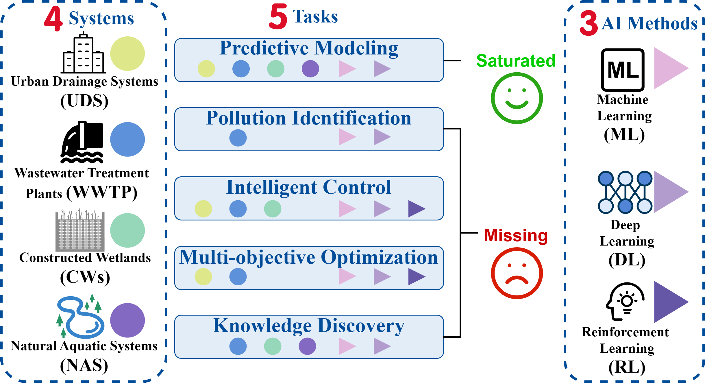
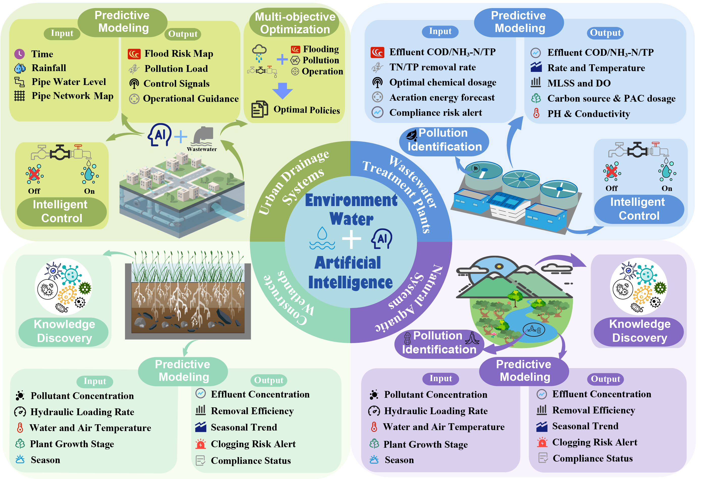

<h1 align="center">A Survey of AI for Water Environmental Systems</h1>

<p align="center">
<a href="https://chuny9743.github.io/">Chun Yang</a><sup>1</sup>, 
<a href="https://simmy-x.github.io/">Simin Xu</a><sup>1</sup>, 
<a href="https://cokeshao.github.io/">Kele Shao</a><sup>1,3,4</sup>, 
<a href="https://eer.lab.westlake.edu.cn/%e4%ba%ba%e5%91%98%e4%bf%a1%e6%81%af-%e6%95%99%e5%b7%a5-%e9%83%ad%e8%a5%bf%e8%be%89/">Xihui Guo</a><sup>1</sup>, 
<a href="https://github.com/WeiZhiWater">Wei Zhi</a><sup>2</sup>, 
<a href="https://eer.lab.westlake.edu.cn/%e4%ba%ba%e5%91%98%e4%bf%a1%e6%81%af-%e6%95%99%e5%b7%a5-%e5%ad%94%e4%bb%a4%e4%b8%ba-2/">Lingwei Kong</a><sup>1*</sup>, 
<a href="https://eer.lab.westlake.edu.cn/%e4%ba%ba%e5%91%98%e4%bf%a1%e6%81%af-%e6%95%99%e5%b7%a5-%e6%9d%8e%e5%87%8c/">Ling Li</a><sup>1</sup>, 
<a href="https://huanwang.tech/">Huan Wang</a><sup>1*</sup>
</p>

<p align="center">
<sup>1</sup> Westlake University &nbsp;&nbsp;
<sup>2</sup> Hohai University
<sup>3</sup> Zhejiang University
<sup>4</sup> Shanghai Innovation Institute
</p>

<p align="center">
<sup>*</sup> Corresponding authors: 
Huan Wang (wanghuan@westlake.edu.cn); 
Lingwei Kong (konglingwei@westlake.edu.cn)
</p>

📌 This repository accompanies our survey paper:

> **[A Survey of AI for Water Environmental Systems](Paper.pdf)**
---

## 📖 Abstract

Artificial intelligence (AI) has expanded its applications in water environmental systems, including Urban Drainage Systems (UDS), Wastewater Treatment Plants (WWTP), Natural Aquatic Systems (NAS), and Constructed Wetlands (CWs).  

Unlike previous reviews focusing on single systems or specific tasks, this survey adopts a **system–task unified perspective**, organizing AI applications into five core tasks:

- Predictive Modeling  
- Pollution Identification  
- Intelligent Control  
- Multi-objective Optimization  
- Knowledge Discovery  

We analyze cross-system imbalances, methodological evolution, and future directions including closed-loop control, coordinated optimization, and edge-level deployment.

---

# 🌊 System–Task Framework

## 🔷 Task–System Relationship



**Fig. 1.** Color-coded mapping of artificial intelligence tasks and method categories across water environmental systems. The figure illustrates the relationships among four representative water environmental systems, five core AI tasks, and three major AI method categories. Colored circular markers denote task–system associations, with consistent colors indicating the corresponding system in which the task has been investigated. Triangular markers represent AI method categories (machine learning, deep learning, and reinforcement learning), with different colors distinguishing method types and indicating their associations with specific tasks. The absence of a marker suggests limited or no reported AI applications for the corresponding task–system or task–method combination.

---

## 🔷 AI Integration Overview



**Fig. 2.** The four surrounding boxes correspond to urban drainage systems, wastewater treatment plants, natural aquatic systems, and constructed wetlands. Within each box, the major AI tasks that have been widely investigated in the corresponding system are summarized, illustrating how different water environmental systems emphasize distinct task combinations.

---

# 🧩 Water Environmental Systems

We organize literature by **system first**, then by **task categories**.

---

This repository organizes AI applications across four systems.

- [UDS(Urban Drainage Systems)](docs/UDS.md)
- [WWTP(Wastewater Treatment Plants)](docs/WWTP.md)
- [NAS（Natural Aquatic Systems）](docs/NAS.md)
- [CWs(Constructed Wetlands)](docs/CWs.md)

<p>
<b>Method Categorization.</b> In this survey, “ML” denotes traditional machine learning methods and does not include deep learning approaches. Although deep learning (DL) is technically a subfield of machine learning, we separate ML and DL to distinguish conventional algorithms (e.g., RF, SVM, Bayesian models) from neural-network-based methods (e.g., CNN, LSTM, DNN). Reinforcement learning (RL) is treated as a distinct category due to its interaction-based learning paradigm for control and decision-making.
</p>

<p>
For clarity, each paper is labeled with a colored marker indicating its primary methodological category: 🟢 ML (traditional machine learning), 🔵 DL (deep learning), and 🟠 RL (reinforcement learning).
</p>

<p>
The four collapsible sections below correspond to the four representative water environmental systems: Urban Drainage Systems (UDS), Wastewater Treatment Plants (WWTP), and Natural Aquatic Systems (NAS), Constructed Wetlands (CWs).
</p>

🟢 ML | 🔵 DL | 🟠 RL
<details open>
<summary>
<a><span style="font-size:20px;">UDS(Total Papers: 16)</span></a>
</summary>


<details open>
<summary><b>Predictive Modeling (7)</b></summary>

| Title | Authors | Method | Venue | Paper |
|-------|---------|--------|---------|-------|
| `2025` 🔵 DL<br>[Flood resilience through hybrid deep learning: Advanced forecasting for Taipei's urban drainage system](https://www.sciencedirect.com/science/article/abs/pii/S0301479725008114) | Li-Chiu Chang , Ming-Ting Yang , Fi-John Chang | CNN / BP | Journal of Environmental Management | [Paper](https://www.sciencedirect.com/science/article/abs/pii/S0301479725008114) |
| `2025` 🔵 DL<br>[Incorporating dynamic drainage supervision into deep learning for accurate real-time flood simulation in urban areas](https://www.sciencedirect.com/science/article/abs/pii/S0043135424017159) | Hancheng Ren , Bo Pang , Gang Zhao , Haijun Yu , Peinan Tian , Chenran Xie | UDFM | Water Research | [Paper](https://www.sciencedirect.com/science/article/abs/pii/S0043135424017159) |
| `2025` 🟢 ML<br>[Flood prediction in urban areas based on machine learning considering the statistical characteristics of rainfall](https://www.sciencedirect.com/science/article/pii/S2590061725000122) | Se-Dong Jang, Jae-Hwan Yoo, Yeon-Su Lee, Byunghyun Kim | RF | Progress in Disaster Science | [Paper](https://www.sciencedirect.com/science/article/pii/S2590061725000122) |
| `2024` 🔵 DL<br>[Real-time rainfall and runoff prediction by integrating BC-MODWT and automatically-tuned DNNs: Comparing different deep learning models](https://www.sciencedirect.com/science/article/abs/pii/S0022169424001987) | Amirmasoud Amini, Mehri Dolatshahi, Reza Kerachian | DNN | Journal of Hydrology | [Paper](https://www.sciencedirect.com/science/article/abs/pii/S0022169424001987) |
| `2024` 🟢 ML<br>[SHAP-powered insights into spatiotemporal effects: Unlocking explainable Bayesian-neural-network urban flood forecasting](https://www.sciencedirect.com/science/article/pii/S1569843224003261) | Wenhao Chu , Chunxiao Zhang , Heng Li , Laifu Zhang , Dingtao Shen , Rongrong Li | Bayesian | International Journal of Applied Earth Observation and Geoinformation | [Paper](https://www.sciencedirect.com/science/article/pii/S1569843224003261) |
| `2023` 🔵 DL<br>[Optimized Deep Learning Model for Flood Detection Using Satellite Images](https://www.mdpi.com/2072-4292/15/20/5037) | Andrzej Stateczny, Hirald Dwaraka Praveena, Ravikiran Hassan Krishnappa, Kanegonda Ravi Chythanya and Beenarani Balakrishnan Babysarojam | CNN / ResNet | Remote Sensing | [Paper](https://www.mdpi.com/2072-4292/15/20/5037) |
| `2022` 🔵 DL<br>[Short-term rainfall forecasting using machine learning-based approaches of PSO-SVR, LSTM and CNN](https://www.sciencedirect.com/science/article/abs/pii/S0022169422010332) | Fatemeh Rezaei Aderyani, S. Jamshid Mousavi, Fatemeh Jafari | SVR / LSTM / CNN | Journal of Hydrology | [Paper](https://www.sciencedirect.com/science/article/abs/pii/S0022169422010332) |

</details>

<details  open>
<summary><b>Intelligent Control (5)</b></summary>

| Title | Authors | Method | Venue | Paper |
|-------|---------|--------|---------|-------|
| `2026` 🟠 RL<br>[A knowledge-data fusion framework accelerates deep reinforcement learning for real-time control of urban drainage systems](https://www.sciencedirect.com/science/article/abs/pii/S0043135425018044) | Wenchong Tian , Zhiyu Zhang , Xuan Wang , Hexiang Yan , Zhenliang Liao , Kunlun Xin , Tao Tao , Zhiguo Yuan | - | Water Research | [Paper](https://www.sciencedirect.com/science/article/abs/pii/S0043135425018044) |
| `2025` 🟠 RL<br>[Dimensions of superiority: How deep reinforcement learning excels in urban drainage system real-time control](https://www.sciencedirect.com/science/article/pii/S258991472500012X) | Zhenyu Huang , Yiming Wang , Xin Dong | - | Water Research | [Paper](https://www.sciencedirect.com/science/article/pii/S258991472500012X) |
| `2025` 🔵 DL<br>[Leveraging LSTM-based neuro-evolution for enhanced real-time control in urban drainage systems](https://www.sciencedirect.com/science/article/pii/S2589914725000520) | Shengwei Pei , Lan Hoang , David Butler , Guangtao Fu | LSTM | Water Research X | [Paper](https://www.sciencedirect.com/science/article/pii/S2589914725000520) |
| `2024` 🟠 RL<br>[Improving the interpretability of deep reinforcement learning in urban drainage system operation](https://www.sciencedirect.com/science/article/abs/pii/S0043135423013520) | Wenchong Tian , Guangtao Fu , Kunlun Xin , Zhiyu Zhang , Zhenliang Liao | - | Water Research | [Paper](https://www.sciencedirect.com/science/article/abs/pii/S0043135423013520) |
| `2022` 🟠 RL<br>[Combined Sewer Overflow and Flooding Mitigation Through a Reliable Real-Time Control Based on Multi-Reinforcement Learning and Model Predictive Control](https://agupubs.onlinelibrary.wiley.com/doi/full/10.1029/2021WR030703) | Wenchong Tian, Zhenliang Liao, Guozheng Zhi, Zhiyu Zhang, Xuan Wang | - | Water Resources Research | [Paper](https://agupubs.onlinelibrary.wiley.com/doi/full/10.1029/2021WR030703) |

</details>

<details open>
<summary><b>Multi-objective Optimization (4)</b></summary>

| Title | Authors | Method | Venue | Paper |
|-------|---------|--------|---------|-------|
| `2025` 🟠 RL<br>[Enhancing the resilience of urban drainage system using deep reinforcement learning](https://www.sciencedirect.com/science/article/abs/pii/S0043135425005901) | Wenchong Tian , Zhiyu Zhang , Kunlun Xin , Zhenliang Liao , Zhiguo Yuan | - | Water Research | [Paper](https://www.sciencedirect.com/science/article/abs/pii/S0043135425005901) |
| `2025` 🟠 RL<br>[Pollution-based integrated real-time control for urban drainage systems: a multi-agent deep reinforcement learning approach](https://www.nature.com/articles/s41545-025-00512-z) | Zhenyu Huang, Yiming Wang, Xin Dong, Wei Li, Yangbo Tang & Dazhen Zhang | - | npj Clean Water | [Paper](https://www.nature.com/articles/s41545-025-00512-z) |
| `2025` 🟢 ML<br>[Efficient urban flood control and drainage management framework based on digital twin technology and optimization scheduling algorithm](https://www.sciencedirect.com/science/article/abs/pii/S0043135425006207) | Chenchen Fan , Jingming Hou , Xuan Li , Gangfu Song , Yihui Yang , Xin Liang , Qingshi Zhou , Muhammad Imran , Guangzhao Chen , Ziyi Wang , Pinpin Lu | Digital twin framework | Water Research | [Paper](https://www.sciencedirect.com/science/article/abs/pii/S0043135425006207) |
| `2024` 🟠 RL<br>[Deep Reinforcement Learning for Multi-Objective Real-Time Pump Operation in Rainwater Pumping Stations](https://www.mdpi.com/2073-4441/16/23/3398) | Jin-Gul Joo, In-Seon Jeong and Seung-Ho Kang | - | Water | [Paper](https://www.mdpi.com/2073-4441/16/23/3398) |

</details>

</details>


<details open>
<summary>
<a><span style="font-size:20px;">WWTP(Total Papers: 54)</span></a>
</summary>


<details open>
<summary><b>Predictive Modeling (19)</b></summary>

| Title | Authors | Method | Venue | Paper |
|-------|---------|--------|---------|-------|
| `2025` 🟢 ML<br>[Application of an improved LSTM model based on FECA and CEEMDAN VMD decomposition in water quality prediction](http://nature.com/articles/s41598-025-96941-4) | Jie Long, Chong Lu, Yiming Lei, Zhong Yuan Chen & Yihan Wang | LSTM | Scientific Reports | [Paper](http://nature.com/articles/s41598-025-96941-4) |
| `2025` 🟢 ML<br>[Using Machine Learning to Predict Environmental Parameters and Geographical Locations of Wastewater Treatment Plants Based on Activated Sludge Microbial Communities](https://pubs.acs.org/doi/10.1021/acsestwater.5c00754) | Chang Liu, Xinyuan He, Yang Liu, Husong Guo, Hui He, Lanxia Dong, Zhaosong Huang, Xiangyu Fan | XGBoost | ACS ES&T Water | [Paper](https://pubs.acs.org/doi/10.1021/acsestwater.5c00754) |
| `2025` 🔵 DL<br>[Attention-based deep learning models for predicting anomalous shock of wastewater treatment plants](https://www.sciencedirect.com/science/article/abs/pii/S004313542500106X) | Yituo Zhang , Jihong Wang , Chaolin Li , Hengpan Duan , Wenhui Wang | LSTM | Water Research | [Paper](https://www.sciencedirect.com/science/article/abs/pii/S004313542500106X) |
| `2025` 🟣 ML+DL<br>[Hybrid deep learning framework for real-time DO prediction in aquaculture](https://www.nature.com/articles/s41598-025-10786-5) | Longqin Xu, Wenjun Liu, Cai Chengqing, Tonglai Liu, Xuekai Gao, Ferdous Sohel, Murtaza Hasan, Mansour Ghorbanpour, Shahbaz Gul Hassan & Shuangyin Liu | RF / BP / CNN / SA | Scientific Reports | [Paper](https://www.nature.com/articles/s41598-025-10786-5) |
| `2025` 🔵 DL<br>[Forecasting nitrous oxide emissions from a full-scale wastewater treatment plant using LSTM-based deep learning models](https://www.sciencedirect.com/science/article/pii/S0043135424016531) | Siddharth Seshan , Johann Poinapen , Marcel H. Zandvoort , Jules B. van Lier , Zoran Kapelan | LSTM | Water Research | [Paper](https://www.sciencedirect.com/science/article/pii/S0043135424016531) |
| `2025` 🔵 DL<br>[Data driven multi-stage transformer based framework for intelligent water quality monitoring](https://www.nature.com/articles/s41598-025-25527-x) | Ramya S, S. Srinath & Pushpa Tuppad | Transformer / Auto | Scientific Reports | [Paper](https://www.nature.com/articles/s41598-025-25527-x) |
| `2025` 🟢 ML<br>[AI-driven wastewater management through comparative analysis of feature selection techniques and predictive models](https://www.nature.com/articles/s41598-025-07124-0) | Faruk Dikmen, Ahmet Demir, Bestami Özkaya, Muhammad Owais Raza, Jawad Rasheed, Tunc Asuroglu & Shtwai Alsubai | RF / XGBoost | Scientific Reports | [Paper](https://www.nature.com/articles/s41598-025-07124-0) |
| `2025` 🟢 ML<br>[New approach to predict wastewater quality for irrigation utilizing integrated indexical approaches and hyperspectral reflectance measurements supported with multivariate analysis](https://www.nature.com/articles/s41598-025-01181-1) | Mohamed Gad, Reda Abd El Hamed, Ezzat A. El Fadaly, Ibrahim E. Mousa, Aissam Gaagai, Hani Amir Aouissi, Mohamed Hamdy Eid, Mostafa R. Abukhadra, Haifa A. Alqhtani, Ahmed A. Allam & Salah Elsayed | - | Scientific Reports | [Paper](https://www.nature.com/articles/s41598-025-01181-1) |
| `2025` 🔵 DL<br>[Attention-based deep learning models for predicting anomalous shock of wastewater treatment plants](https://www.sciencedirect.com/science/article/abs/pii/S004313542500106X) | Yituo Zhang , Jihong Wang , Chaolin Li, Hengpan Duan , Wenhui Wang | LSTM | Water Research | [Paper](https://www.sciencedirect.com/science/article/abs/pii/S004313542500106X) |
| `2023` 🔵 DL<br>[Prediction of nitrous oxide emission of a municipal wastewater treatment plant using LSTM-based deep learning models](https://link.springer.com/article/10.1007/s11356-023-31250-9) | Xiaozhen Xu, Anlei Wei, Songjun Tang, Qi Liu, Hanxiao Shi & Wei Sun | LSTM | Environmental Science and Pollution Research | [Paper](https://link.springer.com/article/10.1007/s11356-023-31250-9) |
| `2023` 🔵 DL<br>[Predicting the ammonia nitrogen of wastewater treatment plant influent via integrated model based on rolling decomposition method and deep learning algorithm](https://www.sciencedirect.com/science/article/abs/pii/S221067072300152X) | Kefen Yan , Chaolin Li , Ruobin Zhao , Yituo Zhang , Hengpan Duan , Wenhui Wang | GRU | Sustainable Cities and Society | [Paper](https://www.sciencedirect.com/science/article/abs/pii/S221067072300152X) |
| `2023` 🟣 ML+DL<br>[Machine learning for modeling N2O emissions from wastewater treatment plants: Aligning model performance, complexity, and interpretability](https://www.sciencedirect.com/science/article/abs/pii/S0043135423011077) | Mostafa Khalil, Ahmed AlSayed , Yang Li, Peter A. Vanrolleghem | RF / KNN / DNN | Water Research | [Paper](https://www.sciencedirect.com/science/article/abs/pii/S0043135423011077) |
| `2023` 🔵 DL<br>[DNN model development of biogas production from an anaerobic wastewater treatment plant using Bayesian hyperparameter optimization](https://www.sciencedirect.com/science/article/abs/pii/S1385894723034022) | Hadjer Sadoune, Rachida Rihani, Francesco Saverio Marra | DNN | Chemical Engineering Journal | [Paper](https://www.sciencedirect.com/science/article/abs/pii/S1385894723034022) |
| `2023` 🔵 DL<br>[Prediction of Wastewater Treatment Plant Effluent Water Quality Using Recurrent Neural Network (RNN) Models](https://www.mdpi.com/2073-4441/15/19/3325) | Praewa Wongburi, and Jae K. Park | NLP / RNN / LSTM | Water | [Paper](https://www.mdpi.com/2073-4441/15/19/3325) |
| `2022` 🔵 DL<br>[An Integrated First Principal and Deep Learning Approach for Modeling Nitrous Oxide Emissions from Wastewater Treatment Plants](https://pubs.acs.org/doi/10.1021/acs.est.1c05020) | Kaili Li, Haoran Duan*, Linfeng Liu, Ruihong Qiu, Ben van den Akker, Bing-Jie Ni, Tong Chen, Hongzhi Yin, Zhiguo Yuan, Liu Ye* | - | Environmental Science & Technology | [Paper](https://pubs.acs.org/doi/10.1021/acs.est.1c05020) |
| `2022` 🔵 DL<br>[Water quality prediction model using Gaussian process regression based on deep learning for carbon neutrality in papermaking wastewater treatment system](https://www.sciencedirect.com/science/article/abs/pii/S0013935122002699) | Xin Wan, Xiaoyong Li, Xinzhi Wang, Xiaohui Yi, Yinzhong Zhao, Xinzhong He, Renren Wu, Mingzhi Huang | LSTM / CNN | Environmental Research | [Paper](https://www.sciencedirect.com/science/article/abs/pii/S0013935122002699) |
| `2022` 🔵 DL<br>[Deep learning model based on urban multi-source data for predicting heavy metals (Cu, Zn, Ni, Cr) in industrial sewer networks](https://www.sciencedirect.com/science/article/abs/pii/S0304389422005210) | Yiqi Jiang , Chaolin Li , Hongxing Song , Wenhui Wang | GRU / ANN | Journal of Hazardous Materials | [Paper](https://www.sciencedirect.com/science/article/abs/pii/S0304389422005210) |
| `2021` 🔵 DL<br>[Forecasting effluent and performance of wastewater treatment plant using different machine learning techniques](https://www.sciencedirect.com/science/article/abs/pii/S2214714421004670) | Mustafa El-Rawy , Mahmoud Khaled Abd-Ellah , Heba Fathi , Ahmed Khaled Abdella Ahmed | LSTM | Journal of Water Process Engineering | [Paper](https://www.sciencedirect.com/science/article/abs/pii/S2214714421004670) |
| `2020` 🔵 DL<br>[Time Series Prediction of Wastewater Flow Rate by Bidirectional LSTM Deep Learning](https://link.springer.com/article/10.1007/s12555-019-0984-6) | Hoon Kang, Seunghyeok Yang, Jianying Huang & Jeill Oh | LSTM | International Journal of Control, Automation and Systems | [Paper](https://link.springer.com/article/10.1007/s12555-019-0984-6) |

</details>

<details open>
<summary><b>Pollution Identification (9)</b></summary>

| Title | Authors | Method | Venue | Paper |
|-------|---------|--------|---------|-------|
| `2025` 🟢 ML<br>[Integrating non-target analysis and machine learning: a framework for contaminant source identification](https://www.nature.com/articles/s41545-025-00504-z) | Peng Liu, Ding Pan, Xin-Yi Jiao, Ji-Ning Liu, Peng-Hui Du, Peng-Cheng Li, Meng-Zhu Xue, Yan-Chao Jin, Cai-Shan Wang, Xue-Rong Wang, Ying-Zhi Ding, Guang-Ning Zhu, Jing-Hao Yang, Wen-Ze Wu, Lu-Feng Liang, Xin-Hui Liu & Li-Ping Li | RF / SVC | npj Clean Water | [Paper](https://www.nature.com/articles/s41545-025-00504-z) |
| `2025` 🟢 ML<br>[Hydro-chemical profiling and contaminant source identification in agricultural canals using data driven clustering approaches](https://www.nature.com/articles/s41598-025-08620-z) | Yashaswi Songara, Anupam Singhal, Rahul Dev Garg & Srinivas Rallapalli | Data-driven | Scientific Reports | [Paper](https://www.nature.com/articles/s41598-025-08620-z) |
| `2025` 🟢 ML<br>[Machine learning-assisted source tracing in domestic-industrial wastewater: A fluorescence information-based approach](https://www.sciencedirect.com/science/article/abs/pii/S0043135424015173) | Yaorong Shu , Fanming Kong , Yang He , Linghao Chen , Hui Liu , Feixiang Zan , Xiejuan Lu , Tianming Wu , Dandan Si , Juan Mao , Xiaohui Wu | BP / RF / SVM / NB / KNN | Water Research | [Paper](https://www.sciencedirect.com/science/article/abs/pii/S0043135424015173) |
| `2025` 🔵 DL<br>[Multimodal Learning-Assisted Identification of Effluent Water Quality and Toxicity in Wastewater Treatment Plants](https://pubs.acs.org/doi/10.1021/acs.est.5c04143) | Jie HuRan YinYao PanJinfeng Wang*Hongqiang Ren | CNN | Environmental Science & Technology | [Paper](https://pubs.acs.org/doi/10.1021/acs.est.5c04143) |
| `2024` 🔵 DL<br>[Evaluation of activated sludge settling characteristics from microscopy images with deep convolutional neural networks and transfer learning](https://www.sciencedirect.com/science/article/abs/pii/S2214714424009243) | Sina Borzooei, Leonardo Scabini, Gisele Miranda , Saba Daneshgar, Lukas Deblieck , Odemir Bruno, Piet De Langhe , Bernard De Baets , Ingmar Nopens , Elena Torfs | CNN | Journal of Water Process Engineering | [Paper](https://www.sciencedirect.com/science/article/abs/pii/S2214714424009243) |
| `2024` 🟢 ML<br>[Accurate identification of sludge contamination sources by classification-based PMF and machine learning with consideration of sewer network distribution differences](https://www.sciencedirect.com/science/article/abs/pii/S0048969723072042) | Chen Qiaoyu, Hu Yanyan, Chen Yue, Yang Lijun, Zhu Benguo, He Qing, Wang Lijuan, Li Juan | RF | Science of The Total Environment | [Paper](https://www.sciencedirect.com/science/article/abs/pii/S0048969723072042) |
| `2023` 🔵 DL<br>[Analyzing the secondary wastewater-treatment process using Faster R-CNN and YOLOv5 object detection algorithms](https://www.sciencedirect.com/science/article/abs/pii/S0959652623020711) | Offir Inbar, Moni Shahar , Jacob Gidron , Ido Cohen , Ofir Menashe , Dror Avisar | R-CNN / YOLOv5 | Journal of Cleaner Production | [Paper](https://www.sciencedirect.com/science/article/abs/pii/S0959652623020711) |
| `2022` 🟢 ML<br>[Integrating Citizen Science and Machine Learning Algorithms for the Recognition of Odour Classes Nearby a Wastewater Treatment Plant](https://www.cetjournal.it/index.php/cet/article/view/CET2295005) | Federico Cangialosi, Edoardo Bruno, Antonio Fornaro | ANN | Chemical Engineering Transactions | [Paper](https://www.cetjournal.it/index.php/cet/article/view/CET2295005) |
| `2021` 🟢 ML<br>[Detection of untreated sewage discharges to watercourses using machine learning](https://www.nature.com/articles/s41545-021-00108-3) | Peter Hammond, Michael Suttie, Vaughan T. Lewis, Ashley P. Smith & Andrew C. Singer | SVM | npj Clean Water | [Paper](https://www.nature.com/articles/s41545-021-00108-3) |

</details>

<details open>
<summary><b>Intelligent Control (8)</b></summary>

| Title | Authors | Method | Venue | Paper |
|-------|---------|--------|---------|-------|
| `2025` 🔵 DL<br>[Application of Soft Actor-Critic algorithms in optimizing wastewater treatment with time delays integration](https://www.sciencedirect.com/science/article/pii/S0957417425008024) | Esmaeel Mohammadi , Daniel Ortiz-Arroyo , Aviaja Anna Hansen , Mikkel Stokholm-Bjerregaard ,Sébastien Gros , Akhil S. Anand , Petar Durdevic | LSTM | Expert Systems with Applications | [Paper](https://www.sciencedirect.com/science/article/pii/S0957417425008024) |
| `2025` 🔵 DL<br>[Research on prediction algorithm of effluent quality and development of integrated control system for waste-water treatment](https://www.nature.com/articles/s41598-025-03612-5) | - | GRU / LSTM / RF / CNN | Scientific Reports | [Paper](https://www.nature.com/articles/s41598-025-03612-5) |
| `2025` 🟢 ML<br>[Automating wastewater characteristic parameter quantitation using neural architecture search in AutoML systems on spectral reflectance data](https://www.nature.com/articles/s41598-025-21069-4) | Shilpa Ankalaki | RF / BP | Scientific Reports | [Paper](https://www.nature.com/articles/s41598-025-21069-4) |
| `2025` 🟢 ML<br>[AquaFlowNet a machine learning based framework for real time wastewater flow management and optimization](https://www.nature.com/articles/s41598-025-99200-8) | P. Prabu, Ala Saleh Alluhaidan, Romana Aziz & Shakila Basheer | AquaFlowNet | Scientific Reports | [Paper](https://www.nature.com/articles/s41598-025-99200-8) |
| `2024` 🟠 RL<br>[Unified control of diverse actions in a wastewater treatment activated sludge system using reinforcement learning for multi-objective optimization](https://www.sciencedirect.com/science/article/abs/pii/S0043135424010789) | Henry C. Croll , Kaoru Ikuma , Say Kee Ong , Soumik Sarkar | - | Water Research | [Paper](https://www.sciencedirect.com/science/article/abs/pii/S0043135424010789) |
| `2023` 🟠 RL<br>[Intelligent Control of Wastewater Treatment Plants Based on Model-Free Deep Reinforcement Learning](https://www.mdpi.com/2227-9717/11/8/2269) | Oscar Aponte-Rengifo, Mario Francisco, Ramón Vilanova, Pastora Vega and Silvana Revollar | - | Processes | [Paper](https://www.mdpi.com/2227-9717/11/8/2269) |
| `2023` 🔵 DL<br>[Machine learning framework for intelligent aeration control in wastewater treatment plants: Automatic feature engineering based on variation sliding layer](https://www.sciencedirect.com/science/article/abs/pii/S0043135423011168) | Yu-Qi Wang , Hong-Cheng Wang , Yun-Peng Song , Shi-Qing Zhou , Qiu-Ning Li , Bin Liang , Wen-Zong Liu , Yi-Wei Zhao , Ai-Jie Wang | VSL | Water Research | [Paper](https://www.sciencedirect.com/science/article/abs/pii/S0043135423011168) |
| `2021` 🟠 RL<br>[Deep Reinforcement Learning-Based Smart Joint Control Scheme for On/Off Pumping Systems in Wastewater Treatment Plants](https://ieeexplore.ieee.org/document/9474446) | Giup Seo; Seungwook Yoon; Myungsun Kim; Changho Mun; Euiseok Hwang | - | IEEE Access | [Paper](https://ieeexplore.ieee.org/document/9474446) |

</details>

<details open>
<summary><b>Multi-objective Optimization (9)</b></summary>

| Title | Authors | Method | Venue | Paper |
|-------|---------|--------|---------|-------|
| `2025` 🟠 RL<br>[Bayesian Optimization-Enhanced Reinforcement learning for Self-adaptive and multi-objective control of wastewater treatment](https://www.sciencedirect.com/science/article/abs/pii/S0960852425001762) | Ziang Zhu , Shaokang Dong , Han Zhang , Wayne Parker , Ran Yin , Xuanye Bai , Zhengxin Yu , Jinfeng Wang , Yang Gao , Hongqiang Ren | - | Bioresource Technology | [Paper](https://www.sciencedirect.com/science/article/abs/pii/S0960852425001762) |
| `2025` 🟠 RL<br>[Multivariable Control of Wastewater Treatment Process Based on Multi-Agent Deep Reinforcement Learning](https://ietresearch.onlinelibrary.wiley.com/doi/full/10.1049/cth2.70021) | Shengli Du, Rui Sun, Peixi Chen | - | IET Control Theory & Applications | [Paper](https://ietresearch.onlinelibrary.wiley.com/doi/full/10.1049/cth2.70021) |
| `2024` 🟢 ML<br>[Machine learning assisted combined systems of wastewater treatment plants with constructed wetlands optimal decision-making](https://www.sciencedirect.com/science/article/abs/pii/S0960852424003468) | Wei Dai , Ji-Wei Pang , Ying-Jun Zhao , Jie Ding , Han-Jun Sun , Hai Cui , Hai-Rong Mi , Yi-Lin Zhao , Lu-Yan Zhang , Nan-Qi Ren , Shan-Shan Yang | - | Bioresource Technology | [Paper](https://www.sciencedirect.com/science/article/abs/pii/S0960852424003468) |
| `2024` 🟢 ML<br>[Multimodal Machine Learning Guides Low Carbon Aeration Strategies in Urban Wastewater Treatment](https://www.sciencedirect.com/science/article/pii/S2095809924000547) | Hong-Cheng Wang , Yu-Qi Wang , Xu Wang , Wan-Xin Yin , Ting-Chao Yu , Chen-Hao Xue , Ai-Jie Wang | RF | Engineering | [Paper](https://www.sciencedirect.com/science/article/pii/S2095809924000547) |
| `2024` 🟢 ML<br>[Wastewater treatment process enhancement based on multi-objective optimization and interpretable machine learning](https://www.sciencedirect.com/science/article/abs/pii/S0301479724014166) | Tianxiang Liu , Heng Zhang , Junhao Wu , Wenli Liu , Yihai Fang | XGB / BO | Journal of Environmental Management | [Paper](https://www.sciencedirect.com/science/article/abs/pii/S0301479724014166) |
| `2024` 🟢 ML<br>[Development and application of an intelligent nitrogen removal diagnosis and optimization framework for WWTPs: Low-carbon and stable operation](https://www.sciencedirect.com/science/article/abs/pii/S0043135424012363) | Zhichi Chen , Hong Cheng , Xinge Wang , Bowen Chen , Yao Chen , Ran Cai , Gongliang Zhang , Chenxin Song , Qiang He | PTLS-XGBoost | Water Research | [Paper](https://www.sciencedirect.com/science/article/abs/pii/S0043135424012363) |
| `2024` 🟢 ML<br>[Utilizing waste heat in wastewater treatment plants for water desalination: Modeling and Multi-Objective optimization of a Multi-Effect desalination system using Decision Tree Regression and Pelican optimization algorithm](https://www.sciencedirect.com/science/article/abs/pii/S2451904924004025) | Mohammad Alrbai , Sameer Al-Dahidi , Hussein Alahmer , Loiy Al-Ghussain , Hassan Hayajneh , Bashar Shboul , Mosa Abusorra , Ali Alahmer | RF | Thermal Science and Engineering Progress | [Paper](https://www.sciencedirect.com/science/article/abs/pii/S2451904924004025) |
| `2023` 🟢 ML<br>[Simultaneous optimal prediction of various influent indexes based on a model fusion algorithm in wastewater treatment plant](https://www.sciencedirect.com/science/article/abs/pii/S1369703X23002048) | Yadan Yu , Rui Wang , Shunbo Huang , Fan Wang , Hao Zeng , Liyun Wang , Houzhen Zhou , Zhouliang Tan , Yangwu Chen | LR / ANN / DT / RF / KNR / GBDT | Biochemical Engineering Journal | [Paper](https://www.sciencedirect.com/science/article/abs/pii/S1369703X23002048) |
| `2021` 🟢 ML<br>[A hybrid machine learning–based multi-objective supervisory control strategy of a full-scale wastewater treatment for cost-effective and sustainable operation under varying influent conditions](https://www.sciencedirect.com/science/article/abs/pii/S0959652621000731) | SungKu Heo , KiJeon Nam , Shahzeb Tariq , Juin Yau Lim , Junkyu Park , ChangKyoo Yoo | FCM | Journal of Cleaner Production | [Paper](https://www.sciencedirect.com/science/article/abs/pii/S0959652621000731) |

</details>

<details open>
<summary><b>Knowledge Discovery (9)</b></summary>

| Title | Authors | Method | Venue | Paper |
|-------|---------|--------|---------|-------|
| `2025` 🟢 ML<br>[Machine learning assisted in situ synthesis of functional microbiomes towards sustainable wastewater treatment](http://nature.com/articles/s43247-025-02489-6) | Shubo Zhang, Sai Gong, Ran Yin, Jinfeng Wang, Yanru Wang & Hongqiang Ren | GBRT / XBGoost / | Communications Earth & Environment | [Paper](http://nature.com/articles/s43247-025-02489-6) |
| `2025` 🟢 ML<br>[Machine learning-based identification of wastewater treatment plant-specific microbial indicators using 16S rRNA gene sequencing](https://www.nature.com/articles/s41598-025-07952-0) | Jaana Jurvansuu, Annika Länsivaara, Marja Palmroth, Outi Kaarela, Heikki Hyöty, Sami Oikarinen & Kirsi-Maarit Lehto | LR / SVM / RF / DT | Scientific Reports | [Paper](https://www.nature.com/articles/s41598-025-07952-0) |
| `2025` 🟢 ML<br>[Feasibility study of machine learning to explore relationships between antimicrobial resistance and microbial community structure in global wastewater treatment plant sludges](https://www.sciencedirect.com/science/article/abs/pii/S0960852424015827) | Yi Li , Cuicui Tao , Shuyin Li , Wenxuan Chen , Dafang Fu , Chad T. Jafvert , Tengyi Zhu | EML | Bioresource Technology | [Paper](https://www.sciencedirect.com/science/article/abs/pii/S0960852424015827) |
| `2024` 🟢 ML<br>[Machine learning modeling for the prediction of phosphorus and nitrogen removal efficiency and screening of crucial microorganisms in wastewater treatment plants](https://www.sciencedirect.com/science/article/abs/pii/S004896972306357X) | Yinan Zhang , Haizhen Wu , Rui Xu , Ying Wang , Liping Chen , Chaohai Wei | XGBoost | Science of The Total Environment | [Paper](https://www.sciencedirect.com/science/article/abs/pii/S004896972306357X) |
| `2024` 🟢 ML<br>[Modeling nitrogen removal performance based on novel microbial activity indicators in WWTP by machine learning and biological interpretation](https://www.sciencedirect.com/science/article/abs/pii/S0301479724002421) | Yadan Yu , Hao Zeng , Liyun Wang , Rui Wang , Houzhen Zhou , Liang Zhong , Jun Zeng , Yangwu Chen , Zhouliang Tan | SVR / KNR / LR / RF | Journal of Environmental Management | [Paper](https://www.sciencedirect.com/science/article/abs/pii/S0301479724002421) |
| `2023` 🟢 ML<br>[Universal Dynamics of Microbial Communities in Full-Scale Textile Wastewater Treatment Plants and System Prediction by Machine Learning](https://pubs.acs.org/doi/10.1021/acs.est.2c08116) | Jinjin Yu, Siang Nee Tang, Patrick K. H. Lee | LR | Environmental Science & Technology | [Paper](https://pubs.acs.org/doi/10.1021/acs.est.2c08116) |
| `2021` 🔵 DL<br>[Activated sludge models at the crossroad of artificial intelligence—A perspective on advancing process modeling](https://www.nature.com/articles/s41545-021-00106-5) | Gürkan Sin & Resul Al | ANN | npj Clean Water | [Paper](https://www.nature.com/articles/s41545-021-00106-5) |
| `2021` 🟢 ML<br>[Machine-learning insights into nitrate-reducing communities in a full-scale municipal wastewater treatment plant](https://www.sciencedirect.com/science/article/abs/pii/S0301479721018570) | Youngjun Kim , Seungdae Oh | LR / SVM | Journal of Environmental Management | [Paper](https://www.sciencedirect.com/science/article/abs/pii/S0301479721018570) |
| `2021` 🟢 ML<br>[Machine learning application reveal dynamic interaction of polyphosphate-accumulating organism in full-scale wastewater treatment plant](https://www.sciencedirect.com/science/article/abs/pii/S2214714421005043) | Seungdae Oh, Youngjun Kim | LR | Journal of Water Process Engineering | [Paper](https://www.sciencedirect.com/science/article/abs/pii/S2214714421005043) |

</details>

</details> 

<details open>
<summary>
<a><span style="font-size:20px;">NAS(Total Papers: 9)</span></a>
</summary>


<details open>
<summary><b>Predictive Modeling (8)</b></summary>

| Title | Authors | Method | Venue | Paper |
|-------|---------|--------|---------|-------|
| `2025` 🟢 ML<br>[Machine learning prediction of ammonia nitrogen adsorption on biochar with model evaluation and optimization](https://www.nature.com/articles/s41545-024-00429-z) | Chong Liu, Paramasivan Balasubramanian, Jingxian An & Fayong Li | CatBoost | npj Clean Water | [Paper](https://www.nature.com/articles/s41545-024-00429-z) |
| `2025` 🔵 DL<br>[Deep representation learning enables cross-basin water quality prediction under data-scarce conditions](https://www.nature.com/articles/s41545-025-00466-2) | Yue Zheng, Xiaoran Zhang, Yongchao Zhou, Yiping Zhang, Tuqiao Zhang & Raziyeh Farmani | Transformer | npj Clean Water | [Paper](https://www.nature.com/articles/s41545-025-00466-2) |
| `2025` 🟢 ML<br>[Quantum machine learning regression optimisation for full-scale sewage sludge anaerobic digestion](https://www.nature.com/articles/s41545-025-00440-y) | Yomna Mohamed, Ahmed Elghadban, Hei I Lei, Amelie Andrea Shih & Po-Heng Lee | Q-CML / MLP | npj Clean Water | [Paper](https://www.nature.com/articles/s41545-025-00440-y) |
| `2025` 🟢 ML<br>[Adversarial susceptibility analysis for water quality prediction models](https://www.nature.com/articles/s41598-025-21797-7) | Jaya Zalte, Ashita Rai, Harshal Shah & M. H. Fulekar | RF / Bagging / LSTM / DT | Scientific Reports | [Paper](https://www.nature.com/articles/s41598-025-21797-7) |
| `2025` 🟢 ML<br>[Analyzing Multi-Year Nitrate Concentration Evolution in Alabama Aquatic Systems Using a Machine Learning Model](https://www.mdpi.com/2076-3298/12/3/75) | Bahareh KarimiDermani, Christopher T. Green, Geoffrey R. Tick, Hossein Gholizadeh, Wei Wei and Yong Zhang | LSTM | Environments | [Paper](https://www.mdpi.com/2076-3298/12/3/75) |
| `2025` 🟢 ML<br>[Machine learning-supported quantification and characterization of sediment plastic debris in an Anthropized Mfoundi River in Cameroon: Implications for the incidence of flood events](https://www.sciencedirect.com/science/article/pii/S0048969725011702) | Desmond N. Shiwomeh , Sameh A. Kantoush , Mohamed Saber , Tetsuya Sumi , Wilson Y. Fantong , Binh Quang Nguyen , Karim I. Abdrabo , Emad Mabrouk | RF / XGBoost | Science of The Total Environment | [Paper](https://www.sciencedirect.com/science/article/pii/S0048969725011702) |
| `2025` 🟢 ML<br>[Enhanced prediction of total organic carbon in a large complex watershed (the Han River, South Korea) by integrating machine learning with real-time in-situ water quality parameters and fluorescence intensities](https://www.sciencedirect.com/science/article/abs/pii/S0013935125028713) | Haeseong Oh , Ho-Yeon Park , Jung Hyun Choi , Jin Hur | XGBoost | Environmental Research | [Paper](https://www.sciencedirect.com/science/article/abs/pii/S0013935125028713) |
| `2024` 🟢 ML<br>[Multi-temporal image analysis of wetland dynamics using machine learning algorithms](http://sciencedirect.com/science/article/abs/pii/S0301479724031098) | Rana Waqar Aslam , Iram Naz , Hong Shu , Jianguo Yan , Abdul Quddoos , Aqil Tariq , J. Brian Davis , Adel M. Al-Saif , Walid Soufan | RF | Journal of Environmental Management | [Paper](http://sciencedirect.com/science/article/abs/pii/S0301479724031098) |

</details>

<details open>
<summary><b>Knowledge Discovery (1)</b></summary>

| Title | Authors | Method | Venue | Paper |
|-------|---------|--------|---------|-------|
| `2025` 🟢 ML<br>[Building Predictive Understanding of the Activated Sludge Microbiome by Bridging Microbial Growth Kinetics and Microbial Population Dynamics](https://pubs.acs.org/doi/10.1021/acs.est.5c05925) | Zhang Cheng, Weibo Xia, Sean McKelvey, Qiang He, Yuzhou Chen*, Heyang Yuan | Bayesian | Environmental Science & Technology | [Paper](https://pubs.acs.org/doi/10.1021/acs.est.5c05925) |

</details>

</details> 


<details open>
<summary>
<a><span style="font-size:20px;">CWs(Total Papers: 17)</span></a>
</summary>


<details open>
<summary><b>Predictive Modeling (14)</b></summary>

| Title | Authors | Method | Venue | Paper |
|-------|---------|--------|---------|-------|
| `2025` 🟣 ML+DL<br>[Prediction of total phosphorus removal in hybrid constructed wetlands: a machine learning approach for rice mill wastewater treatment](https://onlinelibrary.wiley.com/doi/10.1002/wer.70085) | Suresh Kumar, Naveen Chand, Vikramaditya Sangwan, Surinder Deswal | MLR / ANN / SVM / RF | Water Environment Research | [Paper](https://onlinelibrary.wiley.com/doi/10.1002/wer.70085) |
| `2025` 🔵 DL<br>[Leveraging Fine-Scale Variation and Heterogeneity of the Wetland Soil Microbiome to Predict Nutrient Flux on the Landscape](https://link.springer.com/article/10.1007/s00248-025-02516-1) | N. Reed Alexander, Robert S. Brown, Shrijana Duwadi, Spencer G. Womble, David W. Ludwig, Kylie C. Moe, Justin N. Murdock, Joshua L. Phillips, Allison M. Veach & Donald M. Walker | - | Microbial Ecology | [Paper](https://link.springer.com/article/10.1007/s00248-025-02516-1) |
| `2024` 🟣 ML+DL<br>[Machine Learning Application for Nutrient Removal Rate Coefficient Analyses in Horizontal Flow Constructed Wetlands](https://pubs.acs.org/doi/abs/10.1021/acsestwater.4c00121) | Saurabh SinghAbhishek SotiNiha Mohan KulshreshthaAkshat SamariaUrmila BrighuAkhilendra Bhushan Gupta*Achintya N. Bezbaruah* | SVR / RF / ANN | ACS ES&T Water | [Paper](https://pubs.acs.org/doi/abs/10.1021/acsestwater.4c00121) |
| `2024` 🟢 ML<br>[New Perspective for the Prediction of Pollutant Removal Efficiency in Constructed Wetlands: Using a Genetic Algorithm-Assisted Machine Learning Model](https://pubs.acs.org/doi/10.1021/acsestwater.4c00635) | Shu-Zhe ZhangHong Jiang* | RF | ACS ES&T Water | [Paper](https://pubs.acs.org/doi/10.1021/acsestwater.4c00635) |
| `2024` 🟣 ML+DL<br>[A Futuristic Approach to Subsurface-Constructed Wetland Design for the South-East Asian Region Using Machine Learning](https://pubs.acs.org/doi/10.1021/acsestwater.4c00346) | Saurabh Singh*Gourav SutharNiha Mohan KulshreshthaUrmila BrighuAchintya N BezbaruahAkhilendra Bhushan Gupta* | MLR / XGBoost / RF / SVR / ANN | ACS ES&T Water | [Paper](https://pubs.acs.org/doi/10.1021/acsestwater.4c00346) |
| `2024` 🟢 ML<br>[Predicting wetland soil properties using machine learning, geophysics, and soil measurement data](https://link.springer.com/article/10.1007/s11368-024-03801-1) | Dejene L. Driba, Efemena D. Emmanuel & Kennedy O. Doro | XGBoost | Journal of Soils and Sediments | [Paper](https://link.springer.com/article/10.1007/s11368-024-03801-1) |
| `2023` 🟢 ML<br>[Quantitative prediction of the hydraulic performance of free water surface constructed wetlands by integrating numerical simulation and machine learning](https://www.sciencedirect.com/science/article/abs/pii/S0301479723005339) | Changqiang Guo, Di Wan , Yalong Li , Qing Zhu , Yufeng Luo , Wenbing Luo , Yuanlai Cui | RF / MLP / SVR | Journal of Environmental Management | [Paper](https://www.sciencedirect.com/science/article/abs/pii/S0301479723005339) |
| `2023` 🔵 DL<br>[Deep learning-based prediction of effluent quality of a constructed wetland](https://www.sciencedirect.com/science/article/pii/S2666498422000631) | Bowen Yang , Zijie Xiao , Qingjie Meng , Yuan Yuan , Wenqian Wang , Haoyu Wang , Yongmei Wang , Xiaochi Feng | LSTM / CNN / GRU | Environmental Science and Ecotechnology | [Paper](https://www.sciencedirect.com/science/article/pii/S2666498422000631) |
| `2023` 🟣 ML+DL<br>[Deep learning-based prediction of effluent quality of a constructed wetland](https://www.sciencedirect.com/science/article/pii/S2666498422000631) | Bowen Yang , Zijie Xiao , Qingjie Meng , Yuan Yuan , Wenqian Wang , Haoyu Wang , Yongmei Wang , Xiaochi Feng | LR / BPNN / LSTM | Environmental Science and Ecotechnology | [Paper](https://www.sciencedirect.com/science/article/pii/S2666498422000631) |
| `2022` 🟢 ML<br>[Machine learning exhibited excellent advantages in the performance simulation and prediction of free water surface constructed wetlands](https://www.sciencedirect.com/science/article/abs/pii/S0301479722002675) | Changqiang Guo, Yuanlai Cui | - | Journal of Environmental Management | [Paper](https://www.sciencedirect.com/science/article/abs/pii/S0301479722002675) |
| `2022` 🔵 DL<br>[Simulating and predicting the performance of a horizontal subsurface flow constructed wetland using a fully connected neural network](https://www.sciencedirect.com/science/article/abs/pii/S0959652622045322) | P Li, T Zheng, L Li, X Lv, WJ Wu, Z Shi, X Zhou, G Zhang, Y Ma, J Liu | FCNN | Journal of Cleaner Production | [Paper](https://www.sciencedirect.com/science/article/abs/pii/S0959652622045322) |
| `2022` 🟢 ML<br>[Developing a new approach for design support of subsurface constructed wetland using machine learning algorithms](https://www.sciencedirect.com/science/article/abs/pii/S0301479721019307) | Xuan Cuong Nguyen, Thi Thanh Huyen Nguyen , Quyet V. Le , Phuoc Cuong Le , Arun Lal Srivastav , Quoc Bao Pham , Phuong Minh Nguyen , D. Duong La, Eldon R. Rene , H. Hao Ngo , S. Woong Chang , D. Duc Nguyen | RF / SVM | Journal of Environmental Management | [Paper](https://www.sciencedirect.com/science/article/abs/pii/S0301479721019307) |
| `2022` 🟢 ML<br>[Performance prediction of horizontal flow constructed wetlands by employing machine learning](https://www.sciencedirect.com/science/article/abs/pii/S2214714422007085) | Saurabh Singh , Niha Mohan Kulshreshtha , Shubham Goyal , Urmila Brighu , Achintya N. Bezbaruah , Akhilendra Bhushan Gupta | SVR | Journal of Water Process Engineering | [Paper](https://www.sciencedirect.com/science/article/abs/pii/S2214714422007085) |
| `2021` 🟢 ML<br>[Nitrogen removal in subsurface constructed wetland: Assessment of the influence and prediction by data mining and machine learning](https://www.sciencedirect.com/science/article/abs/pii/S2352186421003606) | Xuan Cuong Nguyen , Quang Viet Ly , Jianxin Li , Hyokwan Bae , Xuan-Thanh Bui ,Thi Thanh Huyen Nguyen , Quoc Ba Tran , Thi-Dieu-Hien Vo , Long D. Nghiem | RF / SVM / KNN | Environmental Technology & Innovation | [Paper](https://www.sciencedirect.com/science/article/abs/pii/S2352186421003606) |

</details>

<details open>

<summary><b>Intelligent Control (2)</b></summary>

| Title | Authors | Method | Venue | Paper |
|-------|---------|--------|---------|-------|
| `2025` 🟢 ML<br>[Artificial Intelligence for Constructed Wetlands: Toward Intelligent, Adaptive, and Autonomous Treatment Systems](https://www.ajmrd.com/wp-content/uploads/2025/11/A7110112.pdf) | Mohab Amin Kamal | - | American Journal of Multidisciplinary Research & Development (AJMRD) | [Paper](https://www.ajmrd.com/wp-content/uploads/2025/11/A7110112.pdf) |
| `2025`<br>[Intelligent Analysis and Information Intelligent Control System for Online Monitoring Data of Water Ecological Wetland Landscape Environment](https://www.pjoespeai.com/pdf-210115-132496?filename=Intelligent%20Analysis%20and.pdf) | Zhixian Li, Jing Li, Feng Han, Shui Ai*, Zhanghua Li | - | Polish Journal ofEnvironmental Studies: Politics, Economics and Industry | [Paper](https://www.pjoespeai.com/pdf-210115-132496?filename=Intelligent%20Analysis%20and.pdf) |

</details>
</details> 


# 📎 Citation

If you find this repository useful, please cite:

```bibtex
@article{yang2026AIWater,
  title={A Survey of AI for Water Environmental Systems},
  author={Yang, Chun and Xu, Simin and Guo, Xihui and Zhi, Wei and Kong, Lingwei and Li, Ling and Wang, Huan},
  year={2026}

}
